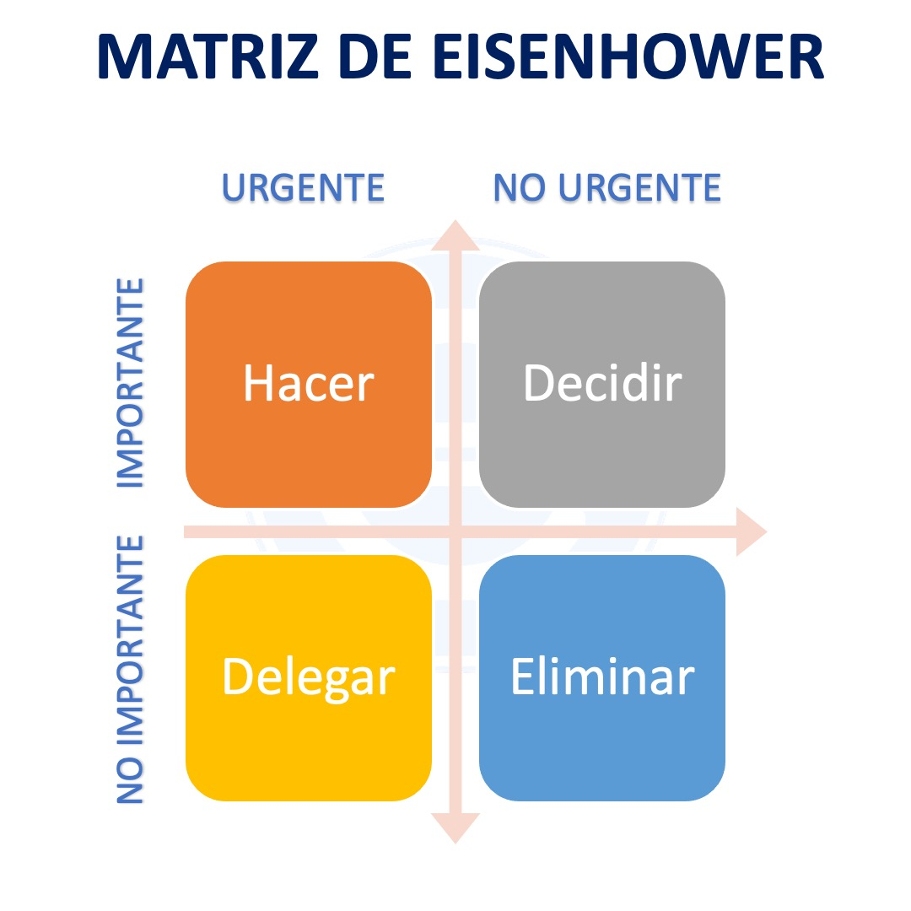
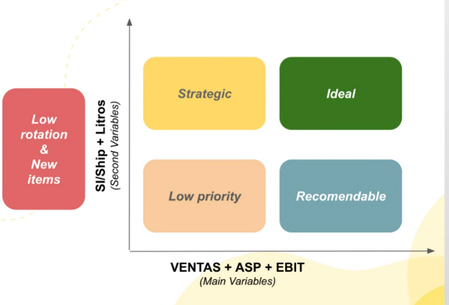

# 1° Sesion: Module Data Science (17.5.2023)

## First Lesson

### Algunas frases interesantes:

- Datos: insumos con los que contamos una historia. 
- Somos detectives de los datos. 
- Tortura los datos y pueden confesar cualquier cosa!!! -> No hay que hacerlo tanto. Buena practica

### Sesgos cognitivos que todos tenemos:

- Sesgo de confirmación: Es muy posible que yo confirme la hipotesis que yo tengo en la cabeza
- Sesgo de disponibilidad: Los datos confirman algo que es lo que yo mas creo o mas conocimiento tengo
- Sesgo de ancla.
- Sesgo de atribución del error. Afirmaciones que son a prubas de datos
- Sesgo de aversión al riesgo. Miedo al riesgo que hace que a veces no seamos tan creativos como podríamos. 

### Errores comunes con datos

- Correlación vs Causalidad: Lejos estan de ser lo mismo
- Sesgo de muestreo
- Sesgo de representación grafica
- Extrapolaciones equivocadas por errores en las tendencias incluidas.

Ejemplos de aplicacion:

- Pricing automatico
- Mostrar distintos productos a distintos clientes

### Big Data:

Complejidad:

- Volumen.
- Velocidad de crecimiento.
- Estructuración de esa información.

Ejemplo: 32 compras por segundo en Meli. 

Paradigma de ciencias:

- Empirico
- Luego Teoretico. Usa modelos y generalizaciones
- Luego computacional. Simulaciones de fenomenos complejos
- Finalmente Data Science. Abarca todos los anteriores. 

### Data Science:

Componentes:

- Ciencias de la computación.
- Matemáticas y estadísticas.
- Negocio y domonio del mercado en el que actuamos. Elemento clave infra valorado. 

### Data Science Challenges:

- Volumen de datos.
- Almacenamiento de datos.
- Interoperabilidad entre las tecnologias de almacenamiento.
- Limpieza de datos. Importante y absolutamente infra valorado. 
- Interpretabilidad de los modelos. Una regresión lineal es facil de explicar, pero una red neuronal no es tan simple de explicar y muchas veces se vuelve una fricción. 

TODO: Buscar en trens.google.es cuanto se busco data science y inteligencia artificial a traves del tiempo. En los ultimos años veremos un crecimiento exponencial.

### Inteligencia Artificial

Es la habilidad que tiene una maquina para usar capacidades propias de los humanos como el aprendizaje, razonamiento, planificacion y creatividad. Aunque suene loco la inteligencia artificial viene funcionando desde 1956, el data science desde 1962, el machine learning desde 1997 y el deep learning desde 21016 con Alpha Go.

### Machine Learning

Es el estuido de algoritmos que permiten pronosticar el comportamiento de determinadas variables. 

- Modelos supervisados de ML: 
  Tu tienes el label de los datos. Compro / no compro. Se murió / no se murió. Conejo / Perro / Gato. Basicamente yo tengo la variable que yo quiero predecir la tengo disponible antes de ejecutar el algoritmo. 
- Metodos: clasificación y regresión. 
- Usos: Reconocimiento de imagenes / analisis predictivo / detección de spam
- Challenges: Mucho tiempo de entrenamiento para el modelo / Hay que meterle data limpia y bien organizada, es muy estricto en el uso de los datos que consumen. 

----------------------------
- Modelos no supervisados de ML:
  Tu no tienens una etiqueta previa de la que partir. Se generan al ejecutar el algoritmo. Son muy usados en el mundo del marketing. +
- Funcionamiento: comienza a clasificar de acuerdo a caracteristicas que son muy parecidas.
- Usa el metodo de clustering, reglas de asociación y reducción de dimensiones.
- Ejemplos: Detección de anomalias, cliente persona, recomendation engine

------------------------------
- Modelos mixtos de ML
  Una parte de la data tiene labels y otra parte de la data no tiene labels. 
-----------------------------

### Roles en Data Science:

- Product Owner: Relación con el negocio y priorización
- Business Analyst: Analisis inicial de la información
- Data Analyst: Interpretación de la data y visualización
- Data Scientist: Transforma las necesidades de negocio en un modelo.
- Data Engineer: Disponibiliza toda la información. Rol muy infra valorado.
- Machine Learning Engineer: Pone en producción el modelo diseñado. 

Hoy día apostamos a perfiles mucho mas cross que puedan operar en mas de un rol de los descriptos arriba. 

**Fin de la primera clase.**

---------------------------------------

# 2° Sesión: Data Discovery (24.5.2023):

Mas info sobre la sesión en [PPT de la sesión](DataLane%20de%20Data%20Science%20Presentaci%C3%B3n.pptx).

Data Science: project pipeline:

Metodologia CRISP-DM: 

- Entendimiento del negocio
- Entendimiento de la data
- Preparación de la data
- Modelamiento o modelado de la data
- Evaluación
- Vuelvo al entendimiento del negocio y hago de nuevo el ciclo hasta que estoy listo para
- Deployment

Data Science Project in Meli:

- Inducción de negocio: Estimar el impacto potencial de la iniciativa
- Target: definición de un accionable de negocio y objetivo
- Data: integración de fuentes de datos y creación de features. La data responde a mi target? 
- Modelo ML: Entrenamiento, pueba y valor incremental. ¿Hasta donde puede escalar este modelo? 
- Producción: Monitoreo y Reentrenamiento
- Medición: Validación del target y medición de impacto, visualización
- Cambio Cultural: Impulsar las decisiones basadas en el producto. Que el mismo sirva para el negocio y sea parte de la cultura del negocio en si misma. 

Generación de hipotesis: (tres partes)

1- Idea
2- Problem Statement:
  A- Negocio: ¿Que deberiamos poder resolver? Key Question, Actionable, KPI´s
  B- Data & Analytics: ¿Tenemos los datos sufiencientes? (factibilidad) ¿Existe una solución actual para el problema? (bencmark) ¿Como priorizar el problema? ¿Que es urgente y que importante? (Prioritization) y el ROI
3- Hypotesis

### Problem Statement: Negocio

- Key Question: 
  
  debe tener un proposito, un que? un como? y un cuando? SMART goals. La respuesta a mi pregunta debe tener un accionable en función de esa respuesta. 

- Actionable

                Actionable
              --------------
                 Insights
          ---------------------
                Information
      -----------------------------
                   Data

Un accionable debe tener contexto, relevancia, especificidad, claridad y novedad. 

- KPI: Key Performance Indicator: Se definen al comienzo de un proyecto y son una guia a largo plazo para orientar los esfuerzos. A veces ya vienen junto con el requerimiento del negocio y a veces hay que crearlos junto con la solución. 

Tips: dedicarle tiempo al comienzo del proyecto. Trabajarlos en forma conjunta con el negocio porque ellos son los especialistas en su accionar. 

### Problem Statement: Data & Analytics

- Factibilidad: Es posible conseguir los datos que el negocio necesita? Que casos de uso voy a considerar? Que fuentes de datos voy a usar? Que sites o Business Unit voy a considerar? 
- Benchmark: Comparación de resultados con una solución previa. Al igual que los KPI´s se debe mirar al comienzo del proyecto. 
- Prioritization: Matriz de Eisenhower cruza urgencia e importancia y es una buena forma de resolver nuestra priorización. 

- ROI: Return on investment: Requiere interaccion con el negocio y representa el compromiso de la iniciativa. A mayor ROI debería haber mayor beneficio. 

-----------------------------------------

# 3° Sesion: ML Canvas (31.5.2023)

Es un resumen de la iniciativa que nuclea 

- Goal o Propuesta de Valor
- Learn o Lo que necesitamos aprender para implementar la solución
- Predict o Que vamos a predecir
- Evaluate o Que tan bien estuvo esta solución

### Manos a la obra

- Data pre processing,
- Exploratory Data Analysis
- Feature Engineering

- Data Preprocesing:
En Data pre procesing a veces se usan algoritmos ya construidos para pre procesar los datos... El ciclo de pre procesing es:; Data integration, Data Transformation, Data Reduction or Dimension Reduction y Data Cleaning.

- Exploratory Data Analysis (EDA):
Consiste en conocer el dataset, filas, columnas, medidas de tendencia central. Se puede hacer con Pandas-Python o se puede hacer directamente en Tableau, etc. Hacer un EDA es todo un arte. Tengo varios EDA´s en mi portfolio en Github para consultar realizados en Pandas Python. Dependiendo el tipo de datos siempre nos vamos a encontrar con gráficas que dan muchas mas información que otros. 

- Recencia: Cada cuanto ocurre un evento y cuanto dura
- Frecuencia: Cuantas veces un usuario hizo algo. 
- Valores: Que tanto, pero en valores, no frecuencias, se hace algo. Ej: Cuanto dinero se tiene en MP?
- Juntar columnas si es que vemos correlación entre las mismas. 

- Feature Engineering: Tal vez el punto mas complejo del "manos a la obra" en data science...
¿Cuales de esos features me sirven para mi modelo? Meto feature, pruebo el modelo, decido si lo dejo o saco, etc. Dejo los datos con los nombres que tienen? Transformo variables numericas a categoricas para que sea mas facil para mi modelo? etc. 

- Feature importance: cual feature va aportar mas a mi solución. El dato es importante para mi modelo? Ejemplo. Problema del titanic. La mayoria de los sobrevivientes del titanic fueron mujeres. ¿Que hago con eso? Me suma a un modelo para predecir supervivencia? 
- Feature extraction
- Feature Selection
- Feature construction
- Feature learning

Todas estas necesitan mucho brainstorming y un equipo muy multidisciplinario. Dado que se requiere mucho conocimiento del negocio ademas del conocimiento tecnico. 

Tecina de Feature Engineering mas usada en Meli:
**ABT, Analytical Base Table**: Es como un stock de features que cualquiera puede consumir desde cualquier ambiente de python de Meli. Es una librería que se puede usar en BigQuery y Python o Dataiku. Usando ABT todos estamos hablando el mismo idioma, usando las mismas features. Si necesitamos otra feature podemos pedirla para sumarla. 

-------------------------------------------------------

# 4° Season: Clasificación (Aprendizaje supervisado)

Problemas a abordar en Machine Learning. 

Antes vimos como es la estrategia de enfrentamiento ante un problema de data science. Como es la estrategía, el canvas, el modelo de enfrentamiento frente a un problema de data science. 

Ahora vamos a adentrarnos en el mundo de data science y vamos a hablar de clasificación. 

- Definición
- Tipos
- Algoritmos y librerias
- Metricas
- Etc

**Definición**: modelo "supervisado": le pasamos al algoritmos elementos clasificados y etiquetados para entrenar el modelo (información previa) para que luego el algoritmo funcione como una "maquina etiquetadora" para nuevos elementos. 

**Tipos de clasificación**:
- Binaria: etiqueta que puede definirse de dos posibles formas: 0 o 1. Convencionalmente 0 es el estado normal y 1 es el que mas nos interesa. Es una convención arbitraria pero muy usada. 
- Multi-class Classification: 2 o mas etiquetas
- Imbalanced Classification: Hay 2 o mas etiquetas pero cada elemento puede tener mas de 1 etiqueta. Problema de clasificación multi clase y multi etiqueta. 

**Librerías**:
Existen librerías que ya tienen casi todos los algoritmos de machine learning existentes por lo que hoy ya practicamente no son necesarios programarlos. 
- Scikit-learn
- XGBoost
- LightGBM
- CatBoost

**Algoritmos**
Ver lista de algoritmos en PPT de esta clase en la web de Data Champions
Ej:
- Regresión logistica: De los mas simples, rapidos, eficientes (verdadero caballito de batalla)
- Naive Bayes (Se uso mucho para clasificación de spam por ejemplo)
- K Neighbors Classifier (similitud)
- Decisión Tree Classifier
- Etc...

Leer el link a **5 types of classification algorithms in machine learning**

**Evaluación del modelo**

¿Como evaluamos la calidad de un modelo o algoritmo para resolver un problema de ciencia de datos? 

Errores posibles:
- Error de clasificación: **Predecir algo que no era real.** Algo como 1 cuando en realidad era 0 o viceversa. Error de tipo 1 y error de tipo 2 en estadistica. ¿Que tanto estamos dispuestos a aceptar estos errores de clasificación? 
Metricas: Ver en PPT: 

True Positive (TP) / False Positive (FP) / False Negative (FN) / True Negative (TN)

- Precisión = TP / (TP + FP) : Comparar contra la predicción
- Recall = TP / (TP + FN) : Comparar contra la realidad
- Accuracy = (TP + TN) / (TP+ FP + FN + TN)

Existen algoritmos que rankean a los distintos algoritmos de clasificación para un problema en especifico y que nos permitirá elegir que algoritmo es mas apropiado para nuestro problema. 

**Interpretación del modelo**

El estudio de las variables que afectan al modelo. Es casi tan importante como la selección del algoritmo. Existen algoritmos ya definidos para poder establecer que variables son mas importantes en un modelo. Esto se debe definir o pre definir al menos en el Analisis exploratorio de datos o EDA. **Ver algoritmo SHAP**

**Casos de uso de Machine Learning en Meli**

**Business Case Transport Tagets**: Como puedo aumentar la base de usuarios que hacen recargas de tarjetas de transporte mediante mercado pago. ¿Que usuario es mas probable que haga recarga de estas tarjetas? Tecnica: usar los usuarios mas parecidos a aquellos que ya hayan hecho recargas a las tarjetas de transporte. Luego busco entre todos los demas usuarios cuales tienen caractericas parecidas y le asigno un grado de probabilidad a cada usuario segun su parecido con quien ya usa la tarjeta. Es un calculo de probabilidad para luego poder hacer campañas especificas sobre los que tiene mayor probabilidad de recargar las tarjetas con Mercado Pago. 

Dataiku es un FrontEnd para poder hacer Machine Learning (clasificación por ejemplo) sin escribir codigo necesariamente. 

**Business Case Points**: Como puedo saber si un vendedor que adquiere nuestro point va a seguir usandolo en el mediano y largo plazo o no. Por ejemplo, viendo la cantidad de ventas que hizo en un Q contra las del proximo Q. Si las mismas fueron al menos un 75% de las del Q pasado entonces seguramente lo siga usando, pero si es menos probablemente no logremos retenerlo y sea un churn. 

------------------------------------------------------

## 5° session: Clustering (Aprendizaje no-supervisado)

Vamos a tratar de encontrar nosotros una estructura en los datos para **inferir una buena etiqueta**. No viene dada de antemano como en los algoritmos de clasificación. 

Los algoritmos mas usados son los de **clustering**. Son algoritmos que buscan similitudes entre los datos que recibe para luego armar un sistema de clasificación (por tipo de fruta, por color, por tamaño, etc.). Se pueden armar muchos **clustering** distintos del mismo input. 

Tambien existen un montón de **algoritmos** y de **librerías** que tienen estos algoritmos para hacer clustering. 

Un buen algoritmo de clustering tendría que:

- Tener a los elementos dentro de un cluster juntos y apretados
- Cada cluster debería estar separado tanto como fuera posible. 

Esto no ocurre en la vida real y los clustering terminan siendo mas debiles. 

**Todos los algoritmos de clustering necesitan que les digamos cuantos clusters queremos.** 

- ¿Que es lo que define a un cluster? 

El centro o centroide que es lo que nos da las caracteristicas medias de un cluster. 

Una librería clasica para usar algoritmos como el kmeans para clustering es **Scikit-learn de Python**.

**kmeans** es un algoritmo muy util para identificar **outliers**. 

### Metricas para definir que tan bueno es un cluster / Model evalutation

1. Coeficiente **Silhouette**: A mas grande mejor es el algoritmo
2. Metrica del codo ó tecnica de **elbow**: Buscamos donde se quiebra la relacion entre numeros de clusters e inercia (No la usen)
3. **Calinski-Harabasz**
4. Otra en la misma slide de la ppt

### Casos de uso en Meli de algoritmos de clustering: 

1. Fullfilment: ¿Como determinar que grupo de items nos van a dar un mejor margen de ganancia si los metemos en fullfilment? Distintas variables: precios, volumen, Si/shipments, ventas historicas, EBIT item id. Se probaron distintos algoritmos, kmeans (se basa en distancias que son super sensibles a valores extremos) se descartó, HBSCAN también se descartó porque generaba muchos clusters, CLARANS tuvo problemas de ejecución (ni siquiera terminaban de correr) y se optó por un algoritmo de tipo "Variable Distribution" que es un algoritmo mas simple, no tan cool, pero muy eficiente. Es mas discreto y lo hace mas interpretable. Se armaron 4 clusters (Strategic, Ideal, Low priority y Recomendable):

---------------------------------------------------

